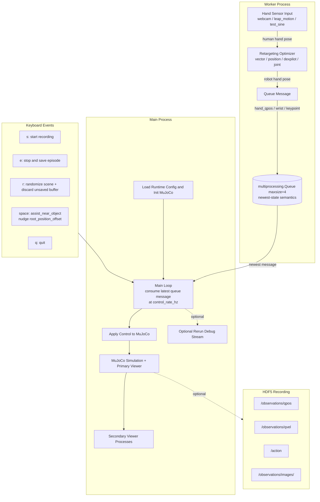

## `my_retargeting_mujoco.py` User Guide



This demo runs a full loop:
**real-time sensing -> retargeting -> MuJoCo control/viewing -> optional HDF5 recording**.

---

### 1. What this script does

- **Input sources (`sensor.input_source`)**
  - `webcam`: MediaPipe hand tracking
  - `leap_motion`: Leap SDK hand tracking
  - `test_sine`: no camera, generates sine-sweep test qpos
- **Retargeting**
  - Modes: `single_left | single_right | bimanual`
  - Optimizers: `vector | position | dexpilot | joint` (`dex` is accepted and mapped to `dexpilot`)
- **Control output**
  - Finger controls always written into `data.ctrl[finger_ctrl_indices]`
  - Wrist/root can be controlled by mocap (`mocap.wrist_mocap=true`) or by root ctrl indices
- **Recording**
  - Save episodes to HDF5 (`qpos`, `qvel`, `action`, camera images)
- **Visualization**
  - MuJoCo passive viewer (by default, launches two viewers for stereoscopic vision; number controlled via `--viewer-count`)
  - Optional Rerun debug stream (`sensor.rerun_enabled=true`)

---

### 2. Runtime architecture

1. Main process:
   - loads runtime YAML
   - starts MuJoCo model + viewer(s)
   - applies control at `simulation.control_rate_hz`
   - handles keyboard events + recording
2. Worker process (`retarget_worker.py`):
   - polls sensor
   - retargets active hands
   - writes a latest-state dict into `multiprocessing.Queue`
3. Main loop consumes the newest queue message and applies control through `MujocoHandController.apply`.

---

### 3. Queue message contract from worker

The worker always emits a dict with fixed keys; missing hand observations are `None`.

- Left side:
  - `hand_left_qpos`
  - `wrist_left_pos`
  - `wrist_left_quat` (`wxyz`)
  - `wrist_left_rot` (`3x3` rotation matrix)
  - `keypoint_left_3d` (`21x3` if available)
- Right side:
  - `hand_right_qpos`
  - `wrist_right_pos`
  - `wrist_right_quat`
  - `wrist_right_rot`
  - `keypoint_right_3d`

`simulation.control_hand` (`left` or `right`) decides which side is applied to MuJoCo control.

---

### 4. How to run

#### 4.1 Basic launch

```bash
python example/vector_retargeting/my_retargeting_mujoco.py --runtime-config-path example/vector_retargeting/runtime_config_example.yml
```

For honda hand project:
```bash
python example/vector_retargeting/my_retargeting_mujoco.py --runtime-config-path src/dex_retargeting/configs/my/teleop_hmf_hand_proto5_release_right_ur7e_joint.yml --dataset-dir data/sim_hmf_proto5_teleop/basketball
```

#### 4.2 Useful CLI flags (from `tyro.cli(main)`)

- `--runtime-config-path`: runtime YAML path
- `--dataset-dir`: episode output root (default `data/hdf5`)
- `--viewer-count`: number of passive viewer processes (default `2`)

#### 4.3 Keyboard controls

- `s` (or `--start-key`): start recording current episode
- `e` (or `--stop-key`): stop and save episode
- `r`: randomize object/goal (and discard unsaved current episode buffer)
- `space`: apply assist move (nudges `root_position_offset` toward object when control hand is detected)
- `q`: quit

---

### 5. Recording output format

Each run creates a timestamp folder under `--dataset-dir` and writes:

- `command.txt`: launch command snapshot
- `episode_<idx>.hdf5`
  - `/observations/qpos`
  - `/observations/qvel`
  - `/action`
  - `/observations/images/<camera_name>`

Notes:

- If XML defines cameras, they are used (or filtered by `simulation.camera_names`).
- If XML has no camera, script records one fallback camera named `default`.
- In `wrist_mocap=true` mode, `/action` is `[mocap_pos(3), mocap_quat(4), ctrl(...)]`; otherwise `/action` is `ctrl`.
- If `simulation.joint_indices` is set, recorded qpos/qvel are sliced by those indices.

---

### 6. Runtime config reference (actual current schema)

Top-level blocks:

```yaml
sensor:
retargeting:
simulation:
```

#### 6.1 `sensor`

- `input_source`: `webcam | leap_motion | test_sine`
- `webcam.index`: camera index (used when `webcam`)
- `camera2table`: required `3x3` transform matrix
- `rerun_enabled`: enable Rerun debug logging

#### 6.2 `retargeting`

- `mode`: `single_left | single_right | bimanual`
- Active hand config must include:
  - `urdf_path`
  - `optimizer`
- `optimizer` can be:
  - string form: `optimizer: vector`
  - dict form:

```yaml
optimizer:
  type: vector
  params:
    ...
```

Minimal structure:

```yaml
retargeting:
  mode: single_left
  left:
    urdf_path: "..."
    add_dummy_free_joint: true
    optimizer:
      type: vector
      params: {}
  right: {}
```

#### 6.3 `simulation`

Core:

- `mj_xml_path`: XML file path or directory (if directory, first `*.xml` is used)
- `startup_keyframe`: optional MJCF keyframe name loaded at startup
- `control_hand`: `left | right`
- `root_ctrl_indices`: length must be `6`
- `finger_ctrl_indices`: non-empty list
- `root_position_offset`: length `3`
- `wrist_rotation_offset_rpy`: optional `[roll, pitch, yaw]` in radians
  - parsed as fixed-axis `R = Rz(yaw) @ Ry(pitch) @ Rx(roll)`
- `control_rate_hz`: must be `> 0`
- `joint_indices`: optional qpos/qvel indices for recording
- `camera_names`: optional camera whitelist for recording

Mocap:

- `mocap.wrist_mocap`: bool
- `mocap.mocap_body_name` or `mocap.mocap_id`

Reset/randomization/assist:

- `random_obj_goal`: list of targets
  - each target: `{name, type: body|site, position_ranges: [[xmin,xmax],[ymin,ymax],[zmin,zmax]]}`
- `task_reset_joint`: `{enabled, name, value}`
- `assist_near_object`:
  - `gain`
  - `max_step_m`
  - `palm_body_name`
  - `obj_body_name`
  - `preset_offset_xyz`

Viewer:

- `viewer_camera` (optional): `lookat`, `azimuth`, `elevation`, `distance`

Important compatibility note:

- `simulation.wrist_rotation_calib_matrix` and `simulation.root_rotation_offset_euler_zyx` are **rejected** by current parser.
- Use `simulation.wrist_rotation_offset_rpy` instead.

---

### 7. Optimizer snippets

Only optimizer blocks are shown below.

#### 7.1 Vector

```yaml
optimizer:
  type: vector
  params:
    target_origin_link_names: ["wrist", "wrist", "wrist", "wrist"]
    target_task_link_names: ["link_15.0_tip", "link_11.0_tip", "link_7.0_tip", "link_3.0_tip"]
    target_link_human_indices: [[0, 0, 0, 0], [4, 8, 12, 16]]
    scaling_factor: 1.6
    low_pass_alpha: 0.2
```

#### 7.2 Position

```yaml
optimizer:
  type: position
  params:
    target_joint_names: null
    target_link_names: ["link_15.0_tip", "link_11.0_tip", "link_7.0_tip", "link_3.0_tip"]
    target_link_human_indices: [4, 8, 12, 16]
    scaling_factor: 1.6
    low_pass_alpha: 0.5
```

#### 7.3 DexPilot

```yaml
optimizer:
  type: dexpilot
  params:
    wrist_link_name: "wrist"
    finger_tip_link_names: ["link_15.0_tip", "link_11.0_tip", "link_7.0_tip", "link_3.0_tip"]
    scaling_factor: 1.6
    low_pass_alpha: 0.2
```

#### 7.4 Joint

```yaml
optimizer:
  type: joint
  params:
    low_pass_alpha: 1
```

---

### 8. Troubleshooting

- Active hand missing `urdf_path` or `optimizer` -> config validation fails.
- `wrist_mocap=true` but wrist not moving -> check mocap body exists and is a mocap body, or set valid `mocap_id`.
- `space` assist appears ineffective -> ensure `assist_near_object` body names match MuJoCo body names and control hand is currently detected.
