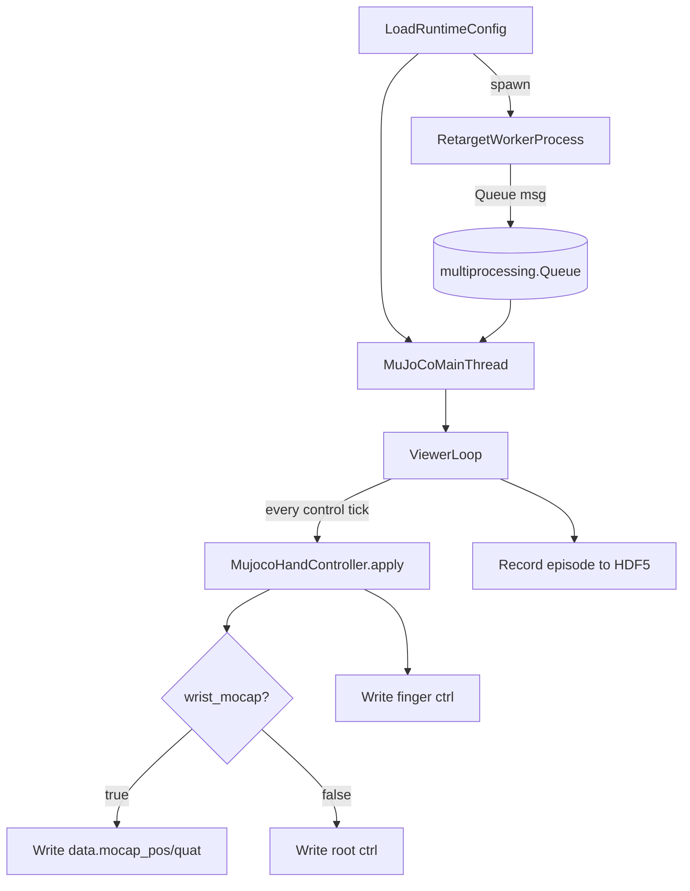

## `my_retargeting_mujoco.py` user guide

This directory provides a full demo: **real-time detection → retargeting → MuJoCo visualization / recording**. After refactoring, the goals are: **config-driven** setup, **subprocesses** to separate detection from retargeting, **main thread** dedicated to simulation and recording, and support for three input sources: `webcam / leap_motion / test_sine`.

---

### 1. Feature overview

- **Input (sensor)**:
  - `webcam`: MediaPipe single-hand tracking (left/right configurable; bimanual mode can run two detectors in parallel)
  - `leap_motion`: Leap SDK (left/right configurable)
  - `test_sine`: no camera; generates test joint trajectories with a sine sweep (to validate the MuJoCo control path)
- **Retargeting**:
  - Optimizer types: `vector / position / dexpilot / joint`
  - Single hand (`single_left` / `single_right`) and bimanual (`bimanual`)
  - `add_dummy_free_joint` (whether to add a 6-DoF dummy joint at the URDF root)
- **Simulation & recording**:
  - Launches the MuJoCo viewer and writes `data.ctrl` at a fixed control rate
  - Can record episodes (HDF5: `qpos` / `qvel` / `action` / `images`)
  - With `wrist_mocap=True`: wrist uses `data.mocap_pos` / `mocap_quat`; fingers still use `data.ctrl`
- **Optional visualization (Rerun)**:
  - If `rerun_enabled=true`, logs hand keypoints and robot joint positions (debug only; not on the main path)

---

### 2. Code layout (module roles)

- `my_retargeting_mujoco.py`  
  Loads config, spawns child processes, main-thread MuJoCo loop, keyboard handling, recording state machine
- `runtime_config.py`  
  New schema: load and validate (supports `left` / `right` only)
- `input_sources.py`  
  Input abstractions: `WebcamInputSource`, `LeapInputSource`, `generate_sine_test_qpos`
- `retarget_worker.py`  
  Child process: init retargeters (one per hand as configured), capture / detect / retarget, write queue messages
- `mujoco_control.py`  
  Main thread: map queue messages to MuJoCo (root / finger `ctrl`, or mocap)

---

### 3. Flow (processes and data)



---

### 4. Child-process queue message (dict contract)

Each frame the child emits one dict. **Keys are always present in full** (hands that were not detected are filled with `None`):

- `hand_left_qpos`: `np.ndarray`, full robot hand joint vector (root + finger; often 22-D)
- `wrist_left_pos`: `np.ndarray(3,)`, wrist position (if the source provides it)
- `wrist_left_quat`: `np.ndarray(4,)`, `wxyz` quaternion (from the wrist rotation matrix)
- `hand_right_qpos` / `wrist_right_pos` / `wrist_right_quat`

Notes:

- `simulation.control_hand` selects which `hand_*_qpos` drives the current MuJoCo scene (in bimanual mode the message has both; the control side can still use one for now).

---

### 5. How to run, interact, and record

#### 5.1 Launch

```bash
python example/vector_retargeting/my_retargeting_mujoco.py --runtime-config-path example/vector_retargeting/runtime_config_example.yml

python example/vector_retargeting/my_retargeting_mujoco.py --runtime-config-path src/dex_retargeting/configs/my/teleop_absolute_pose_allegro_hand_left_joint_runtime.yml
```

#### 5.2 Keyboard

- **`s`**: start recording an episode
- **`e`**: end recording and save HDF5
- **`q`**: quit
- **`r`**: resample object & goal at random positions
- **space**: move assist

#### 5.3 HDF5 output

Episodes are saved under a timestamped directory inside `--dataset-dir`, including:

- `/observations/qpos`
- `/observations/qvel`
- `/action`
- `/observations/images/<camera_name>` (if the scene has cameras, or fallback `default`)

---

### 6. Writing a new config (schema + example)

The config has three top-level blocks: `sensor`, `retargeting`, `simulation`. See `runtime_config_example.yml` for a full example.

#### 6.1 `sensor`

Key fields:

- `input_source`: `webcam | leap_motion | test_sine`
- `webcam.index`: OpenCV camera index (only for `webcam`)
- `camera2table`: 3×3 rotation to map detected point clouds from camera frame to table / world (legacy `CAMERA2TABLE` lives here now)
- `rerun_enabled`: enable Rerun (recommended default `false`)

#### 6.2 `retargeting`

`left` / `right` layout: as in `src/dex_retargeting/configs/my/*_runtime.yml`.

```yaml
retargeting:
  mode: single_left
  left: { urdf_path: ..., add_dummy_free_joint: ..., optimizer: ... }
  right: {}
```

#### 6.3 `simulation`

Key fields:

- `mj_xml_path`: MuJoCo scene XML file or directory (if a directory, the first `.xml` is used)
- `control_hand`: `left | right` (which hand from the message drives the scene)
- `root_ctrl_indices`: six `ctrl` indices (root 6-DoF actuators)
- `finger_ctrl_indices`: sixteen `ctrl` indices (finger actuator order)
- `root_position_offset`: root position bias (for frame alignment)
- `wrist_rotation_calib_matrix`: 3×3 left-multiply calibration on wrist rotation, `R_out = R_cal @ R_wrist` (optional; default identity). Deprecated `root_rotation_offset_euler_zyx` is still accepted and is converted to a ZYX fixed-axis matrix
- `control_rate_hz`: control write rate
- `mocap.wrist_mocap`: use mocap for the wrist
- `mocap.mocap_body_name` or `mocap.mocap_id`: mocap target

---

### 7. Retargeting (optimizer) configs

Below only the `retargeting.*.optimizer` parts are shown (other fields omitted).

#### 7.1 Vector (relative vectors)

```yaml
optimizer:
  type: vector
  params:
    target_origin_link_names: ["wrist", "wrist", "wrist", "wrist"]
    target_task_link_names: ["link_15.0_tip", "link_11.0_tip", "link_7.0_tip", "link_3.0_tip"]
    target_link_human_indices: [[0, 0, 0, 0], [4, 8, 12, 16]]
    scaling_factor: 1.6
    low_pass_alpha: 0.2
```

#### 7.2 Position (absolute positions)

```yaml
optimizer:
  type: position
  params:
    target_joint_names: null
    target_link_names: ["link_15.0_tip", "link_11.0_tip", "link_7.0_tip", "link_3.0_tip"]
    target_link_human_indices: [4, 8, 12, 16]
    scaling_factor: 1.6
    low_pass_alpha: 0.5
```

#### 7.3 DexPilot

```yaml
optimizer:
  type: dexpilot
  params:
    wrist_link_name: "wrist"
    finger_tip_link_names: ["link_15.0_tip", "link_11.0_tip", "link_7.0_tip", "link_3.0_tip"]
    scaling_factor: 1.6
    low_pass_alpha: 0.2
```

#### 7.4 Joint (direct joint optimization)

```yaml
optimizer:
  type: joint
  params:
    low_pass_alpha: 1
```

---

### 8. Common pitfalls and troubleshooting

- **Missing fields**: each active hand should have `urdf_path` and `optimizer` (the unused hand can be `{}`, but validation depends on mode and active hand).
- **`wrist_mocap=True` but wrist does not move**: set `mocap_body_name` correctly (body must be a mocap body) or set `mocap_id` directly.
- **Right-hand vector / DexPilot link order**: right-hand tip link order often differs from the left; your old configs already reflect that; migration keeps them as-is.
- **Drift from inconsistent `camera2table`**: set it once under `sensor.camera2table` instead of hard-coding different versions inside the detector.
