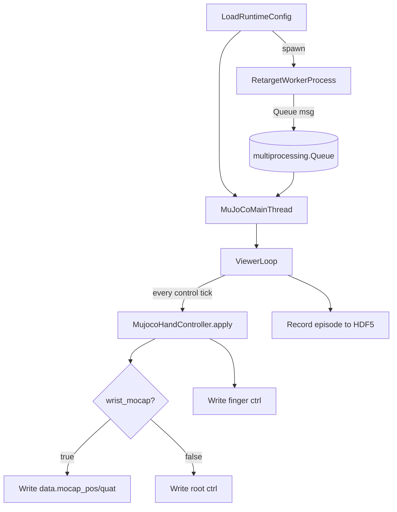

## `my_retargeting_mujoco.py` 使用说明

本目录提供一个“实时检测 → 重定向 → MuJoCo 可视化/录制”的完整 demo。重构后的目标是：**配置驱动**、**子进程解耦检测与重定向**、**主线程专注仿真与录制**，并支持 `webcam / leap_motion / test_sine` 三种输入源。

---

### 1. 核心功能一览

- **输入源（sensor）**：
  - `webcam`：MediaPipe 单手检测（左右手可配置，双手模式可同时跑左右两套 detector）
  - `leap_motion`：Leap SDK（左右手可配置）
  - `test_sine`：不依赖相机，按正弦扫描生成测试关节（用于验证 MuJoCo 控制链路）
- **重定向（retargeting）**：
  - 支持优化器类型：`vector / position / dexpilot / joint`
  - 支持单手（`single_left/single_right`）与双手（`bimanual`）
  - 支持 `add_dummy_free_joint`（决定是否在 URDF 根部添加 6DoF dummy joint）
- **仿真与录制（simulation）**：
  - 启动 MuJoCo viewer，并按固定控制频率写入 `data.ctrl`
  - 支持录制 episode（HDF5：`qpos/qvel/action/images`）
  - 支持 `wrist_mocap=True`：wrist 用 `data.mocap_pos/mocap_quat` 输出；手指仍用 `data.ctrl`
- **可选可视化（Rerun）**：
  - `rerun_enabled=true` 时会输出人手关键点与机器人关节位置（仅用于调试，不影响主流程）

---

### 2. 代码架构（模块职责）

- `my_retargeting_mujoco.py`
  - 读取配置、启动子进程、主线程 MuJoCo 循环、键盘监听与录制状态机
- `runtime_config.py`
  - 新 schema 配置读取与校验（仅支持 `left/right`）
- `input_sources.py`
  - 输入源抽象层：`WebcamInputSource`、`LeapInputSource`、`generate_sine_test_qpos`
- `retarget_worker.py`
  - 子进程：按配置初始化 retargeter（左右手各一套），采集/检测/重定向并往队列写消息
- `mujoco_control.py`
  - 主线程：将队列消息映射到 MuJoCo 控制（root/finger ctrl，或 mocap）

---

### 3. 流程图（进程与数据流）



---

### 4. 子进程输出消息契约（Queue dict）

子进程每帧输出一个 dict，**key 固定全量**（未检测到的手填 `None`）：

- `hand_left_qpos`：`np.ndarray`，机器人手关节向量（包含 root+finger 的完整向量，通常 22 维）
- `wrist_left_pos`：`np.ndarray(3,)`，wrist 位置（若输入源可提供）
- `wrist_left_quat`：`np.ndarray(4,)`，wxyz 四元数（由 wrist rotation matrix 转换）
- `hand_right_qpos` / `wrist_right_pos` / `wrist_right_quat`

说明：
- `simulation.control_hand` 决定主线程用哪只手的 `hand_*_qpos` 去驱动当前 MuJoCo 场景（双手模式下也一样：消息会包含两手，但控制端可先选其一）。

---

### 5. 使用方法（运行、交互、录制）

#### 5.1 启动命令

```bash
python example/vector_retargeting/my_retargeting_mujoco.py --runtime-config-path example/vector_retargeting/runtime_config_example.yml

python example/vector_retargeting/my_retargeting_mujoco.py --runtime-config-path src/dex_retargeting/configs/my/teleop_absolute_pose_allegro_hand_left_joint_runtime.yml
```

#### 5.2 键盘交互

- **`s`**：开始录制一个 episode
- **`e`**：结束录制并保存 HDF5
- **`q`**：退出
- **`r`**：采样 obj & goal 随机位置
- **space**: move assist

#### 5.3 输出数据（HDF5）

episode 文件保存到 `--dataset-dir` 下的时间戳目录中，包含：

- `/observations/qpos`
- `/observations/qvel`
- `/action`
- `/observations/images/<camera_name>`（如果场景里有相机，或 fallback `default`）

---

### 6. 新配置文件怎么写（schema 说明 + 示例）

配置分三段：`sensor`、`retargeting`、`simulation`。完整样例见 `runtime_config_example.yml`。

#### 6.1 `sensor`

关键字段：
- `input_source`: `webcam | leap_motion | test_sine`
- `webcam.index`: OpenCV 相机 index（仅 `webcam` 有意义）
- `camera2table`: 3x3 旋转矩阵（用于把检测得到的点云坐标旋转到桌面/世界系；原来的 `CAMERA2TABLE` 已下沉到此处）
- `rerun_enabled`: 是否启用 Rerun 可视化（建议默认 `false`）

#### 6.2 `retargeting`

`left/right` 写法：你在 `src/dex_retargeting/configs/my/*_runtime.yml` 里看到的就是这种。

```yaml
retargeting:
  mode: single_left
  left: { urdf_path: ..., add_dummy_free_joint: ..., optimizer: ... }
  right: {}
```

#### 6.3 `simulation`

关键字段：
- `mj_xml_path`: MuJoCo 场景 xml 文件或目录（目录会自动找第一个 `.xml`）
- `control_hand`: `left | right`（从消息里选哪只手驱动当前场景）
- `root_ctrl_indices`: 6 个 ctrl index（root 6DoF 对应的 actuator index）
- `finger_ctrl_indices`: 16 个 ctrl index（手指 actuator 顺序映射）
- `root_position_offset`: root 位置偏置（用于坐标对齐）
- `wrist_rotation_calib_matrix`: 3×3 手腕旋转左乘标定矩阵，满足 `R_out = R_cal @ R_wrist`（可选，默认单位阵）。仍支持已弃用的 `root_rotation_offset_euler_zyx`，会按固定轴 ZYX 合成等效矩阵
- `control_rate_hz`: 写 ctrl 的频率
- `mocap.wrist_mocap`: 是否用 mocap 输出 wrist
- `mocap.mocap_body_name` 或 `mocap.mocap_id`: 指定 mocap 目标

---

### 7. 各种 Retargeting（optimizer）配置怎么写

下面只列出 `retargeting.*.optimizer` 的部分（其余字段略）。

#### 7.1 Vector（相对向量）

```yaml
optimizer:
  type: vector
  params:
    target_origin_link_names: ["wrist", "wrist", "wrist", "wrist"]
    target_task_link_names: ["link_15.0_tip", "link_11.0_tip", "link_7.0_tip", "link_3.0_tip"]
    target_link_human_indices: [[0, 0, 0, 0], [4, 8, 12, 16]]
    scaling_factor: 1.6
    low_pass_alpha: 0.2
```

#### 7.2 Position（绝对位置）

```yaml
optimizer:
  type: position
  params:
    target_joint_names: null
    target_link_names: ["link_15.0_tip", "link_11.0_tip", "link_7.0_tip", "link_3.0_tip"]
    target_link_human_indices: [4, 8, 12, 16]
    scaling_factor: 1.6
    low_pass_alpha: 0.5
```

#### 7.3 DexPilot

```yaml
optimizer:
  type: dexpilot
  params:
    wrist_link_name: "wrist"
    finger_tip_link_names: ["link_15.0_tip", "link_11.0_tip", "link_7.0_tip", "link_3.0_tip"]
    scaling_factor: 1.6
    low_pass_alpha: 0.2
```

#### 7.4 Joint（直接优化关节）

```yaml
optimizer:
  type: joint
  params:
    low_pass_alpha: 1
```

---

### 8. 常见坑与排错建议

- **配置缺字段**：请确保每只手都有 `urdf_path` 与 `optimizer`（不用的那只手可以设为 `{}`，但对应模式下会校验活跃手）。
- **`wrist_mocap=True` 但 wrist 不动**：需要正确设置 `mocap_body_name`（且该 body 必须是 mocap body），或直接提供 `mocap_id`。
- **右手 vector/dexpilot 的 link 顺序**：右手很多场景下 tip link 的顺序与左手不同（你旧配置已体现）；迁移配置会保持原样。
- **`camera2table` 不一致导致坐标飘**：统一在 `sensor.camera2table` 设置，避免在 detector 内部写死不同版本。

